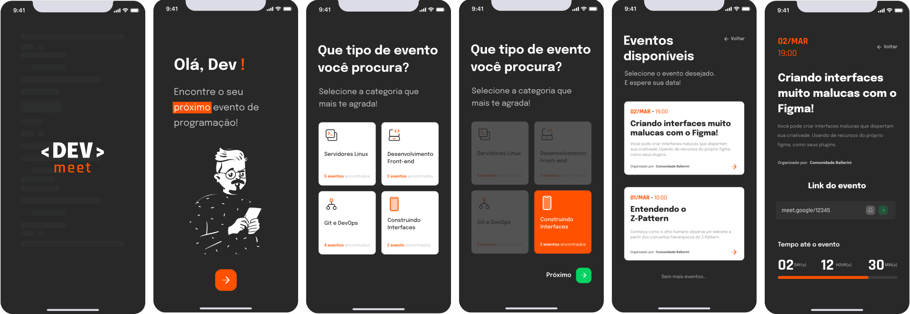

<div align="center" id="top">
  

  &#xa0;
</div>

<h1 align="center">Dev Meet</h1>

<p align="center">
  

  

  

  
</p>

<p align="center">
  <a href="#dart-sobre">Sobre</a> &#xa0; | &#xa0;
  <a href="#rocket-tecnologias">Tecnologias</a> &#xa0; | &#xa0;
  <a href="#white_check_mark-pré-requisitos">Pré requisitos</a> &#xa0; | &#xa0;
  <a href="#checkered_flag-começando">Começando</a> &#xa0; | &#xa0;
  <a href="#memo-licença">Licença</a> &#xa0; | &#xa0;
  <a href="https://github.com/maurodesouza" target="_blank">Autor</a>
</p>

<br>

## :dart: Sobre ##

O Dev Meet é um projeto que foi desenvolvido para o desafio da Tech da semana, que foi proposto pela [comunidade tech](https://discord.gg/wagxzStdcR) da [Rafaella Ballerini](https://github.com/rafaballerini)!

O desafio consiste em criar um pequeno app para consumir uma api fake que fornece dados sobre eventos.

<details>
  <summary>Layout</summary>

  <br>
  
  <br>

  <div align="center">
    <a align="center" href="https://www.figma.com/file/UgZj1C1DWJlVftvMLz1Aq9/Dev-Meet?node-id=1%3A326">Link para o design no Figma</a>
  </div>

</details>
<br>

Para fazer o app utilizei o [Expo](https://nextjs.org) + [Typescript](https://www.typescriptlang.org) ❤

## :rocket: Tecnologias ##

As principais ferramentas usadas na construção desse projeto:

<a href="https://expo.io">
  
</a> &#xa0; &#xa0;

<a href="https://reactnavigation.org">
  
</a> &#xa0; &#xa0;

<a href="https://reactnative.dev">
  
</a> &#xa0; &#xa0;

<a href="https://www.typescriptlang.org">
  
</a> &#xa0; &#xa0;

<br>
<br>

<details>
  <summary>Ver todas</summary>

  <br>

  * [axios](https://github.com/axios/axios)
  * [date-fns](https://date-fns.org)
  * [expo-font](https://docs.expo.dev/guides/using-custom-fonts/)
  * [react-native-svg](https://github.com/awesomejerry/react-native-qrcode-svg)
  * [react-timer-hook](https://www.npmjs.com/package/react-timer-hook)
  * [styled-components](https://styled-components.com)
  * [@expo/vector-icons](https://docs.expo.dev/guides/icons/)
  * [expo-linear-gradient](https://docs.expo.dev/versions/latest/sdk/linear-gradient/)
  * [react-native-webview](https://docs.expo.dev/versions/latest/sdk/webview/)
  * [react-native-reanimated](https://docs.swmansion.com/react-native-reanimated/)
  * [react-native-shimmer-placeholder](https://github.com/tomzaku/react-native-shimmer-placeholder)
</details>

## :white_check_mark: Pré requisitos ##

Antes de começar :checkered_flag:, você precisa ter o [Git](https://git-scm.com), [Node](https://nodejs.org/en/), [Json-server](https://www.npmjs.com/package/json-server) e a [CLI do expo](https://expo.io/tools#cli) instalados em sua maquina :computer:

Opcional - [Ngrok](https://ngrok.com) para facilitar a conexão do nosso app com o servidor!

Também vai precisar ter algum emulador ou o [app do expo](https://play.google.com/store/apps/details?id=host.exp.exponent) instalado no seu celular :iphone:

## :checkered_flag: Começando ##

```bash
# Clone este repositório
$ git clone https://github.com/maurodesouza/dev-meet

# Entre na pasta
$ cd dev-meet

# Instale as dependências
$ yarn

# Inicie o servidor fake, vai abrir em <http://localhost:3000>
$ json-server server.json

# Crie um tunel utilizando o ngrok para expor o seu localhost na porta 3000 [OPCIONAL]
$ ~/ngrok http 3000

# Entre em ./src/services/api e altere o baseURL, apontando para o seu servidor

# Para iniciar o projeto
$ yarn start

# O app vai inicializar em <http://localhost:19002>
```

Depois leia o QRCode com o seu [app do expo](https://play.google.com/store/apps/details?id=host.exp.exponent) ou rode no seu emulador.

*OBS: Testado apenas em android*

## :memo: Licença ##

Este projeto está sob licença MIT. Veja o arquivo [LICENSE](LICENSE.md) para mais detalhes.


Feito com :heart: por <a href="https://github.com/maurodesouza" target="_blank">Mauro de Souza</a>

&#xa0;

<a href="#top">Voltar para o topo</a>
