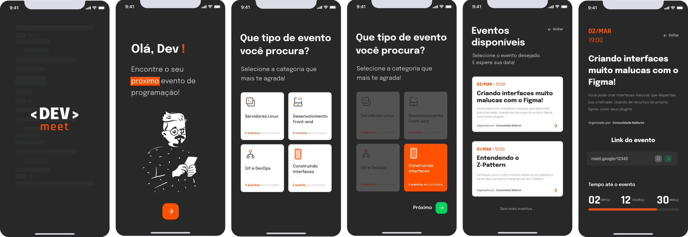

<br />

<div align="center" id="top">
  
</div>

<p align="center">
  

  

  

  
</p>

<p align="center">
  <a href="#dart-about">About</a> &#xa0; | &#xa0;
  <a href="#sparkles-demo">Demo</a> &#xa0; | &#xa0;
  <a href="#rocket-technologies">Technologies</a> &#xa0; | &#xa0;
  <a href="#white_check_mark-prerequisites">Prerequisites</a> &#xa0; | &#xa0;
  <a href="#checkered_flag-getting-started">Getting Started</a> &#xa0; | &#xa0;
  <a href="#memo-license">License</a> &#xa0; | &#xa0;
  <a href="https://github.com/maurodesouza" target="_blank">Author</a>
</p>

## :dart: About

Dev Meet is a project that was developed for the Tech of the Week challenge, proposed by the [tech community](https://discord.gg/wagxzStdcR) of [Rafaella Ballerini](https://github.com/rafaballerini)!

The challenge consists of creating a small app to consume a fake API that provides data about events.

<details>
  <summary>Layout</summary>

  <br>
  
  <br>

  <div align="center">
    <a align="center" href="https://www.figma.com/file/UgZj1C1DWJlVftvMLz1Aq9/Dev-Meet?node-id=1%3A326">Link to the design on Figma</a>
  </div>

</details>
<br>

To build the app I used [Expo](https://nextjs.org) + [Typescript](https://www.typescriptlang.org) ❤

## :sparkles: Demo

<div align="center">
  <video src="https://user-images.githubusercontent.com/54520907/157106229-985c4240-6d79-40d0-ba79-c3846a6a591c.mp4" />
 </div>

## :rocket: Technologies

The main tools used in building this project:

<a href="https://expo.io">
  
</a> &#xa0; &#xa0;

<a href="https://reactnavigation.org">
  
</a> &#xa0; &#xa0;

<a href="https://reactnative.dev">
  
</a> &#xa0; &#xa0;

<a href="https://www.typescriptlang.org">
  
</a> &#xa0; &#xa0;

<br>
<br>

<details>
  <summary>See all</summary>

  <br>

* [axios](https://github.com/axios/axios)
* [date-fns](https://date-fns.org)
* [expo-font](https://docs.expo.dev/guides/using-custom-fonts/)
* [react-native-svg](https://github.com/awesomejerry/react-native-qrcode-svg)
* [react-timer-hook](https://www.npmjs.com/package/react-timer-hook)
* [styled-components](https://styled-components.com)
* [@expo/vector-icons](https://docs.expo.dev/guides/icons/)
* [expo-linear-gradient](https://docs.expo.dev/versions/latest/sdk/linear-gradient/)
* [react-native-webview](https://docs.expo.dev/versions/latest/sdk/webview/)
* [react-native-reanimated](https://docs.swmansion.com/react-native-reanimated/)
* [react-native-shimmer-placeholder](https://github.com/tomzaku/react-native-shimmer-placeholder)

</details>

## :white_check_mark: Prerequisites

Before starting :checkered_flag:, you need to have [Git](https://git-scm.com), [Node](https://nodejs.org/en/), [Json-server](https://www.npmjs.com/package/json-server) and the [Expo CLI](https://expo.io/tools#cli) installed on your machine :computer:

Optional - [Ngrok](https://ngrok.com) to make it easier to connect your app to the server!

You will also need to have an emulator or the [Expo app](https://play.google.com/store/apps/details?id=host.exp.exponent) installed on your phone :iphone:

## :checkered_flag: Getting Started

```bash
# Clone this repository
$ git clone https://github.com/maurodesouza/dev-meet

# Enter the folder
$ cd dev-meet

# Install dependencies
$ yarn

# Start the fake server, it will run at <http://localhost:3000>
$ json-server server.json

# Create a tunnel using ngrok to expose your localhost on port 3000 [OPTIONAL]
$ ~/ngrok http 3000

# Go to ./src/services/api and change the baseURL, pointing to your server

# To start the project
$ yarn start

# The app will run at <http://localhost:19002>
```

Then scan the QR Code using your [Expo app](https://play.google.com/store/apps/details?id=host.exp.exponent) or run it on your emulator.

*NOTE: Tested only on Android*

## :memo: License

This project is under the MIT license. See the [LICENSE](LICENSE.md) file for more details.

Made with :heart: by <a href="https://github.com/maurodesouza" target="_blank">Mauro de Souza</a>

 

<a href="#top">Back to top</a>

*README created with [Simple Readme](https://marketplace.visualstudio.com/items?itemName=maurodesouza.vscode-simple-readme)*
